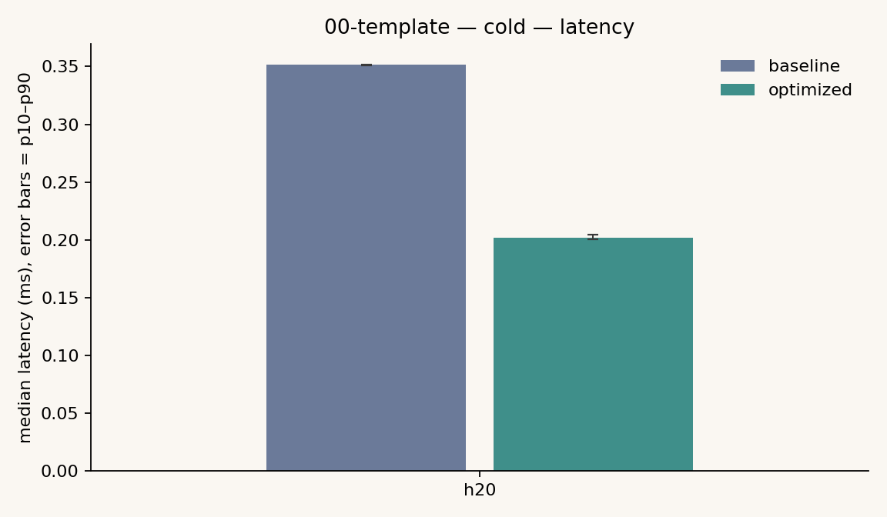
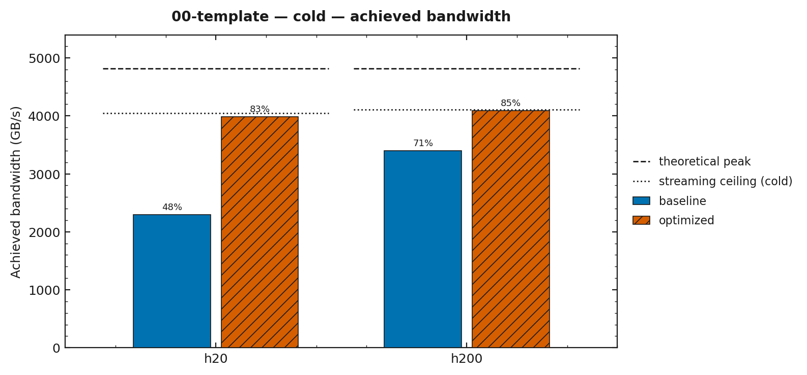
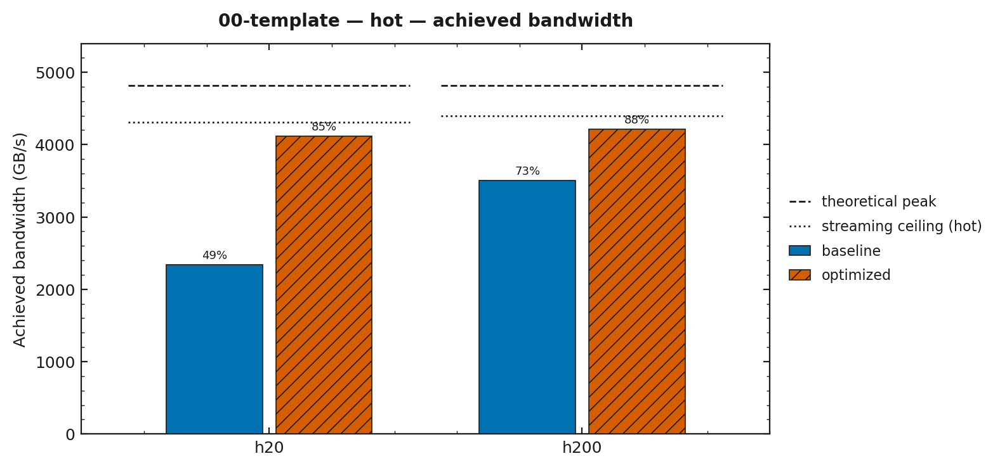

# 00-template

不是一篇文章，是每个篇目目录的形状模板。复制它建新篇：

```bash
cp -r kernels/00-template kernels/{NN}-{slug}
```

然后替换 kernel 与下面每一节的内容。本篇用 triad 的实测数据当填充示例。

## 要验证的问题

- triad（`a = b + s*c`，2 读 1 写）在 h20 上是否已经撞带宽。
- 预期：这是带宽受限 kernel，`optimized`（128 位访存 + 按 SM 定网格）的收益来自更少更宽的
  访存指令，而不是算力。
- 本篇只示范目录形态，不承担系列论点。新篇在这里写「预期在哪台机器收益反号」。

## 目录代码

| 文件 | 作用 |
|---|---|
| `triad.cu` | baseline（标量、按问题定网格）与 optimized（`float4`、`multiProcessorCount*32`）两个 kernel，跑同一输入，先校验后计时 |
| `CMakeLists.txt` | 产出目标 `kernel-00-template` |

## 所用技术

- 128 位向量访存（`float4`）：一条指令搬 16 B，减少访存指令数
- 网格按 device props 推导（`multiProcessorCount * 32`），不写常数
- 共用计时：`bench::measure_cold` / `measure_hot` + `bench::kStreamBufferBytes` 工作集

## 实验数据

来源 `results/00-template/2026-09-14-h20.csv`（h20，fp32，n=67108864）。

| 口径 | variant | median ms | achieved GB/s | % 标称 | TFLOPS |
|---|---|---|---|---|---|
| cold | baseline | 0.3514 | 2291.8 | 47.6% | 0.382 |
| cold | optimized | 0.2020 | 3985.7 | 82.8% | 0.664 |
| hot | baseline | 0.3448 | 2335.7 | 48.5% | 0.389 |
| hot | optimized | 0.1958 | 4113.4 | 85.4% | 0.686 |

结论：optimized 把带宽从 ~48% 提到 ~83–85%（标称 4814 GB/s）。cold/hot 只差约 3%，
说明这里主要不是启动开销，瓶颈在访存。

## 截图






## 复现

```bash
cmake --build build --target kernel-00-template -j
python3 tools/run.py --kernel 00-template --machine h20 --clocks-locked
python3 tools/plot.py results/00-template/*.csv -o figures/00-template/
```
