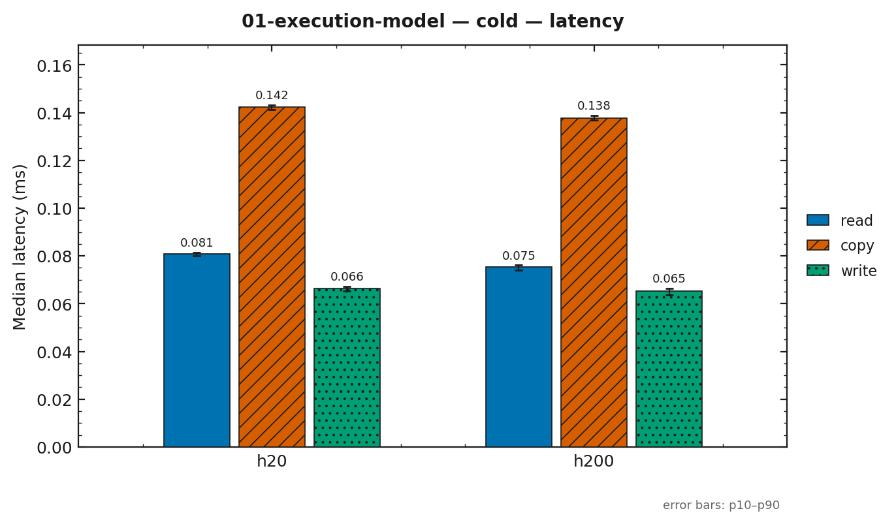
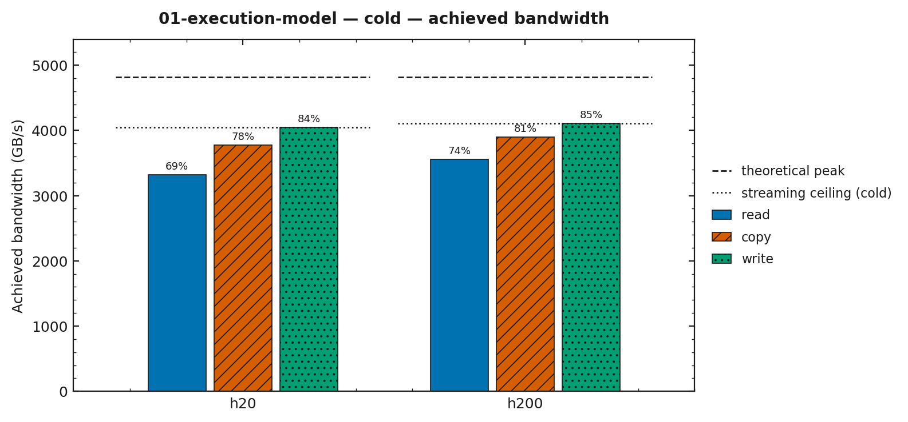
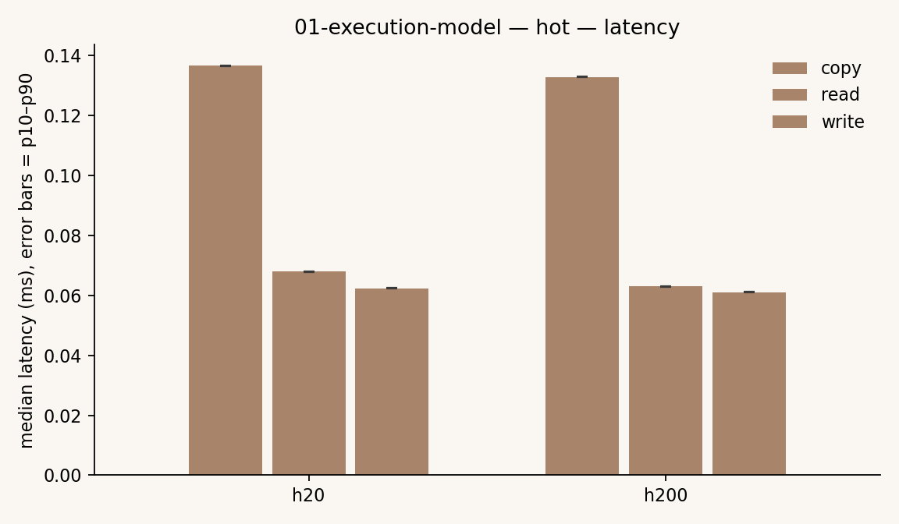
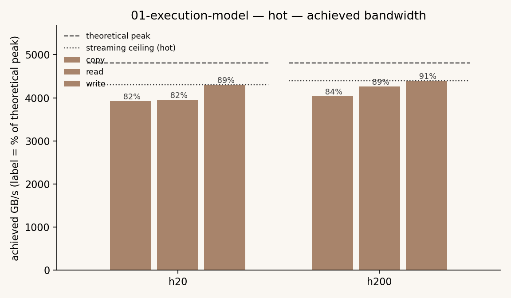

# 01-execution-model

执行模型与三机基线画像。`bench-probe` 是三台机器共用的基线画像工具，也是所有带宽图达成率
分母的来源。

## 要验证的问题

- 三台机器（a100 / h20 / h200）的算力:带宽比（ridge point）到底差多少。
- 预期：h20 与 h200 同 ISA、几乎同带宽，只有算力差 6.7×，ridge point 差 6.6×——同一个优化
  可能在两台上收益反号。
- 本篇不做优化对比，只把「争论任何优化之前必须先钉死的条件」量出来。

## 目录代码

| 文件 | 作用 |
|---|---|
| `probe_main.cu` | `bench-probe`：打印 device props 与特性门，并实测 streaming 上限（read / copy / write，cold / hot）|
| `CMakeLists.txt` | 产出目标 `bench-probe` |

**为什么没有 baseline / optimized**：本篇是基线画像，不是「同一问题两份实现比收益」，因此
只有一个可执行文件；其余篇目才有并列实现。

## 所用技术

- `cudaDeviceGetAttribute`：CUDA 13 已从 `cudaDeviceProp` 移除 clockRate / memoryClockRate /
  computeMode，只能通过 attribute 读取
- 特性门：cc ≥ 9.0 → TMA / cluster / DSMEM / wgmma；cc ≥ 10.0 → tcgen05 / TMEM
- 与 kernel 同一套口径的 streaming 测量：`bench::measure_stream_ceiling`（cold / hot，工作集
  `bench::kStreamBufferBytes`），所以这个上限可以直接当带宽类篇目的分母

## 实验数据

来源 `results/01-execution-model/2026-09-14-h20.csv`（h20，256 MiB 缓冲，同一 cold/hot 口径）。
**本轮只有 h20**，a100 / h200 待接入；且采样时机器非独占（8×vLLM worker 常驻）、未锁频，
按纪律这里只作同会话相对比值，绝对达成率仅供参考。标称带宽 4814 GB/s。

| 口径 | variant | median ms | achieved GB/s | % 标称 |
|---|---|---|---|---|
| cold | read | 0.0809 | 3317.6 | 68.9% |
| cold | copy | 0.1422 | 3775.7 | 78.4% |
| cold | write | 0.0663 | 4046.6 | 84.1% |
| hot | read | 0.0679 | 3954.2 | 82.1% |
| hot | copy | 0.1367 | 3928.8 | 81.6% |
| hot | write | 0.0623 | 4306.3 | 89.4% |

best cold 4046.6 / best hot 4306.3 GB/s，已回填 `bench/machine-peaks.json` 与
`docs/environment-matrix.md`。结论：H20 单次 HBM 流量上限约为标称的 84%（cold）到 89%
（hot）；hot 普遍高于 cold，说明启动开销与冷缓存仍占一部分。读的达成率最低（69%），
受限于 read 的累加依赖与指令发射，不是带宽本身。

尚未完成的部分：a100 / h200 的对应测量，用于兑现「三机 ridge point 差 6.6×」的论证。

**2026-09-15 a100 尝试作废（数字不予采用）**：目标机 8 张 A100 全部被另一份 8 卡训练作业
占用（`utilization.gpu` 100%），逐 kernel 埋事件可见周期性 ~2.8 ms 抢占停顿，批量口径带宽
被压到 ~943 GB/s（真实约 ~1690 GB/s）。按 `docs/measurement-methodology.md` 的独占性判据
（实测前 util 必须为 0）本次无效：未写入本目录 CSV，未回填 `bench/machine-peaks.json`。
设备参数与作废原因见 `docs/environment-matrix.md` 的 a100 一节。

## 截图






## 复现

```bash
cmake --build build --target bench-probe -j
./build/kernels/01-execution-model/bench-probe
```
