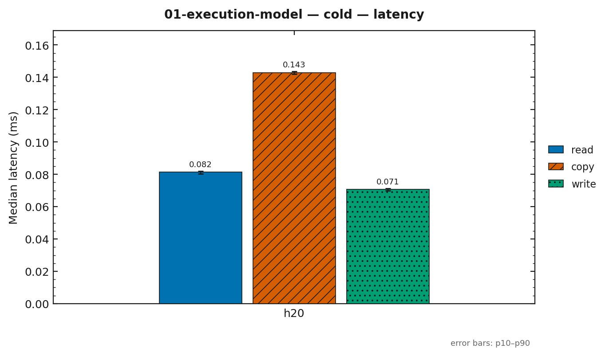
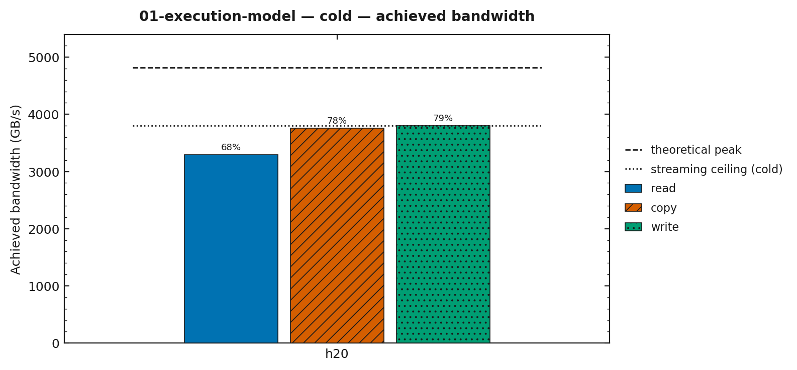
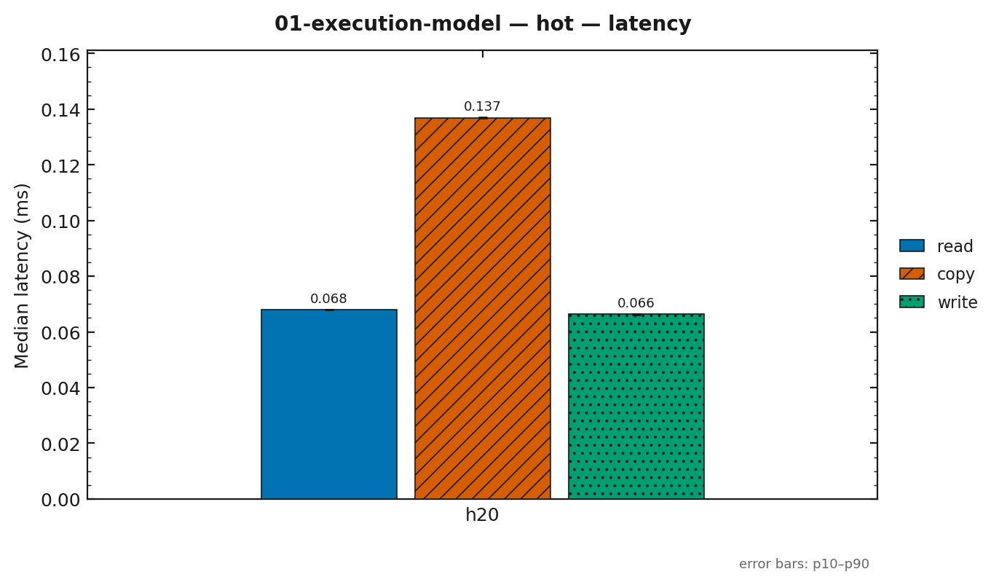
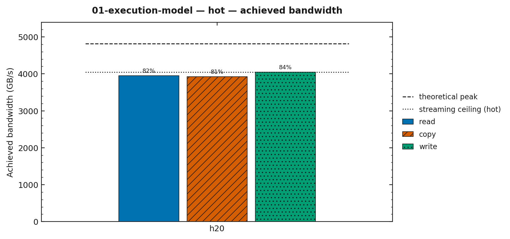

# 01-execution-model

执行模型与三机基线画像。本篇不优化任何东西，只回答一个前置问题：**后面每篇说「达成了 X%」
「快了 Y 倍」的时候，那个 100% 和那台机器到底是什么**。

## 为什么要先做这组实验

后面 17 篇都在做同一件事：写一个 kernel，报它跑出多少带宽或算力，再和机器的上限比。这个比法有两个
前提，不先钉死，后面的数字都没法解读：

1. **这台机器是带宽受限还是算力受限。** 同一个优化，在带宽受限的机器上有效，在算力受限的机器上
   可能白做甚至变慢。判断的尺子是 ridge point = 峰值算力 ÷ 峰值带宽。h20 与 h200 同为 `sm_90a`、
   标称显存带宽相同，但算力（148 vs 989 TFLOPS）与 SM 数（78 vs 132）都不同，BF16 ridge point 差 6.6 倍——所以「Hopper
   优化」这个说法没有意义，得说是哪一台。这部分来自 datasheet，见 `docs/environment-matrix.md`。
2. **「100%」该用哪个数。** datasheet 的标称带宽（h20/h200 为 4814 GB/s）是物理上限，但即使是最
   简单、最理想的访存 kernel 也跑不到它。如果只拿标称值当分母，后面所有 kernel 看起来都很差，
   分不清是 kernel 写得差，还是这台机器本来就只能跑到那么多。

所以 `bench-probe` 用三个最朴素的 kernel——只读（read）、拷贝（copy）、只写（write）——在
256 MiB 缓冲区上实测「一个写得很好的简单 kernel 能跑到多快」。三者最好的那个，就是这台机器的
**streaming 上限**，写进 `bench/machine-peaks.json`。之后每篇的带宽图都画两条参考线：

- 标称峰值：回答「离硬件上限还有多远」
- streaming 上限：回答「离一个理想的简单 kernel 还有多远」

两条线之间的差距本身就是信息：那是连完美访存都拿不回来的部分，不该算到后面任何一个 kernel
头上。本轮锁频 H20 会话里这个差距是 hot 约 16%、cold 约 21%（见下文「本轮锁频 H20 会话」）。

## cold 和 hot 是什么，为什么测两组

每个 kernel 的耗时都按两种方式各测一遍，含义在全系列固定：

| | cold（冷启动） | hot（热重放） |
|---|---|---|
| 怎么测 | 每次计时前先清空 L2，然后只启动**一次** kernel，计这一次 | 把连续 20 次启动录成 CUDA Graph，整体重放，耗时除以 20 |
| 数字里包含 | 启动开销 + 冷缓存 + kernel 本身 | 基本只剩 kernel 本身（启动开销被 20 次摊薄，缓存已热） |
| 对应真实场景 | 模型每层只跑一次的算子：一次前向里它就被调用一遍 | decode 循环：同一个 kernel 每个 token 反复跑 |

两组都要测，因为它们回答不同的问题，而后面的 kernel 两种场景都会遇到。规则只有一条：**只和同
口径的数比**——cold kernel 比 cold 上限，hot 比 hot。混着比，会把「省掉的启动开销」错当成
「kernel 变快了」。

本篇数据里 hot 比 cold 高约 6–7%（本轮到 2026-09-26 锁频 H20 会话为 best 4048 vs 3798 GB/s，
+6.6%），这部分就是启动开销与冷缓存。它不大，但足以让一个本没有收益的优化看起来「快了 6%」，
所以必须拆开。

「为什么必须清 L2、为什么只报分位数」这些测量纪律的完整论证在第 02 篇
（`kernels/02-measurement-discipline/`），那里把每一种错误测法都实际量了一遍。

## 要验证的问题

- 三台机器（a100 / h20 / h200）各自的 streaming 上限是多少，离标称值多远。
- h20 与 h200 带宽标称相同、算力差 6.7 倍：多出来的算力和 SM 数，对访存上限有没有影响？
- 本篇不做优化对比，只产出后面每篇都要用的两个分母。

**与提纲的差异**：`docs/series-outline.md` 第 01 篇要求的 occupancy 静态扫描现已实现，并已在
2026-09-26 的锁频 H20 会话采集（`results/01-execution-model/occupancy/2026-09-26-h20.csv`）。
它用四个实际寄存器用量不同的 probe kernel，调用
`cudaOccupancyMaxActiveBlocksPerMultiprocessor` 扫 SMEM，记录理论驻留块数；这**只是静态驻留
上界**，不等于实测 occupancy，更不等于性能。提纲设想第 01 篇不做计时，但 streaming 上限必须计时；
它用的是和所有 kernel 相同的 `bench::measure_cold` / `measure_hot`，口径在第 02 篇交代。

## 目录代码

| 文件 | 作用 |
|---|---|
| `probe_main.cu` | `bench-probe`：打印 device props 与特性门，并实测 streaming 上限（read / copy / write，cold / hot）|
| `occupancy_scan.cu` | 静态资源扫描：实际寄存器数 × 动态 SMEM → 理论驻留块数、warp 数与 occupancy |
| `generate_occupancy_probes.py` | 生成四个寄存器压力不同的 probe kernel；以编译后的 `actual_regs_per_thread` 为准 |
| `CMakeLists.txt` | 产出目标 `bench-probe` 与 `occupancy-scan` |

**为什么没有 baseline / optimized**：本篇是基线画像，不是「同一问题两份实现比收益」，因此
只有一个可执行文件；其余篇目才有并列实现。

## 所用技术

- `cudaDeviceGetAttribute`：CUDA 13 已从 `cudaDeviceProp` 移除 clockRate / memoryClockRate /
  computeMode，只能通过 attribute 读取
- 特性门：cc ≥ 9.0 → TMA / cluster / DSMEM / wgmma；cc ≥ 10.0 → tcgen05 / TMEM
- 与 kernel 同一套口径的 streaming 测量：`bench::measure_stream_ceiling`（cold / hot，工作集
  `bench::kStreamBufferBytes`），所以这个上限可以直接当带宽类篇目的分母
- `cudaFuncGetAttributes` + `cudaOccupancyMaxActiveBlocksPerMultiprocessor`：用编译后的实际
  寄存器数做横轴；若 `local_bytes_per_thread` 非零，需把 spill 作为限制声明

## 实验数据

数据来源：

- **h20（本轮，可引用）** — `results/01-execution-model/2026-09-26-h20.csv`（commit `0025113`，
  锁频 1800 MHz，独占静默门禁通过，`git_dirty=no`）
- h20 / h200（9 月探索性背景，未锁频，只作相对比值） —
  `2026-09-14-h20.csv`（`dfa8153`）、`2026-09-15-h200.csv`（`b56c035`）
- a100 — **无有效数据**，见下文「a100 占位」

口径：256 MiB 缓冲、fp32、cold/hot 分开、30 次采样报分位数（下表取 median）。三卡标称带宽
h20/h200 同为 **4814 GB/s**（`bench/machine-peaks.json`）。

**禁止混用**：本轮新图只吃 2026-09-26 的 H20 CSV，不与 9 月未锁频数据同图；`bench/machine-peaks.json`
的 H20 `bw_ceiling_*` 已换成下面这轮锁频值。

### 本轮锁频 H20 会话（2026-09-26，可引用）

锁频 1800 MHz（GPU 时钟实测采样恒为 1800），驱动 615.71.09，H20-3e，MIG Disabled，ECC on，
目标卡静默门禁 PRE 60 s / POST 30 s 均 `util=0` 通过。

| variant | 口径 | median GB/s | % 标称(4814) | min GB/s | p90 GB/s |
|---|---|---|---|---|---|
| read | cold | 3293.5 | 68.4% | 3362.2 | 3273.0 |
| read | hot | 3949.3 | 82.0% | 3961.4 | 3942.3 |
| copy | cold | 3755.8 | 78.0% | 3799.2 | 3737.7 |
| copy | hot | 3920.7 | 81.4% | 3928.5 | 3917.5 |
| write | cold | 3797.5 | 78.9% | 3840.9 | 3761.2 |
| write | hot | 4047.9 | 84.1% | 4061.2 | 4040.5 |
| **best** | **cold** | **3797.5** | **78.9%** | — | — |
| **best** | **hot** | **4047.9** | **84.1%** | — | — |

（`min`/`p90` 两列按 `min_ms`/`p90_ms` 换算；本轮 best cold = write cold，best hot = write hot。）

- 达成率比 9 月未锁频值低（当时 hot 到 89.5%）：**锁到 1800 MHz 后，bandwidth-bound kernel
  同样受限**，实测 SM 时钟从 1980 降到 1800。因此这里的绝对达成率只在「本轮 1800 MHz、
  驱动 615.71.09、H20-3e」条件下成立；`docs/environment-matrix.md` 记录了完整条件。
- cold/hot 差距：best +6.6%（3798 → 4048 GB/s）。
- 运行时的实际 SM 时钟由 `tools/run.py` 采样写入 CSV，不是手填。

#### 静态 occupancy 扫描（不是实测性能）

来源：`results/01-execution-model/occupancy/2026-09-26-h20.csv`。四个 probe kernel 的实际寄存器数
由编译结果给出；SMEM 是动态分配的扫描轴。**这张表只给理论驻留上界**，不能推出「哪个更快」。

| 实际 regs/thread | SMEM = 0 | 16 KiB | 32 KiB | 48 KiB | 64 KiB | 96 KiB | 128–192 KiB |
|---|---|---|---|---|---|---|---|
| 32 | 100% | 100% | 75% | 50% | 37.5% | 25% | 12.5% |
| 40 | 75% | 75% | 75% | 50% | 37.5% | 25% | 12.5% |
| 64 | 50% | 50% | 50% | 50% | 37.5% | 25% | 12.5% |
| 94 | 25% | 25% | 25% | 25% | 25% | 25% | 12.5% |

（数值为 `theoretical_occupancy_pct`，SMEM 档位 0/16/32/48/64/96/128/160/192 KiB；扫描含 36 行。
`requested_accumulators` 只是生成压力候选，横轴以编译后的 `actual_regs_per_thread` 为准。）

- 寄存器压力与 SMEM 共同决定驻留块数，两者任一超标都会先掉块。
- 相同占用下**不保证更快**：占用是「能不能驻留」的上界，性能还要看访存与指令。本表不参与
  任何性能结论。

### 9 月探索性背景：实测带宽（median）

> **未锁频、非独占（h20 当时 8×vLLM worker 常驻），只作同会话相对比值，不作为可引用绝对上限。**
> `bench/machine-peaks.json` 的 H20 `bw_ceiling_*` 已改用 2026-09-26 锁频会话的值，**不是**下表这组。

| variant | 口径 | h20 GB/s | h20 %标称 | h200 GB/s | h200 %标称 | h200/h20 | a100 GB/s | a100 %标称 |
|---|---|---|---|---|---|---|---|---|
| read | cold | 3317.6 | 68.9% | 3559.0 | 73.9% | 1.073 | 待采集 | 待采集 |
| read | hot | 3954.2 | 82.1% | 4263.4 | 88.6% | 1.078 | 待采集 | 待采集 |
| copy | cold | 3775.7 | 78.4% | 3899.0 | 81.0% | 1.033 | 待采集 | 待采集 |
| copy | hot | 3928.8 | 81.6% | 4042.3 | 84.0% | 1.029 | 待采集 | 待采集 |
| write | cold | 4046.6 | 84.1% | 4111.1 | 85.4% | 1.016 | 待采集 | 待采集 |
| write | hot | 4306.3 | 89.4% | 4398.1 | 91.4% | 1.021 | 待采集 | 待采集 |
| **best** | **cold** | **4046.6** | **84.1%** | **4111.1** | **85.4%** | **1.016** | 待采集 | 待采集 |
| **best** | **hot** | **4306.3** | **89.4%** | **4398.1** | **91.4%** | **1.021** | 待采集 | 待采集 |

### h20 / h200 对比分析

这组对比的价值在于：两卡同为 `sm_90a`、同为 141GB HBM3e、标称带宽同为 4814 GB/s，
但 SM 数（78 vs 132，1.69×）与算力（BF16 148 vs 989 TFLOPS，6.7×）都不同。
标称 HBM 带宽近似相同降低了一项混淆，但这不是只改变算力的受控实验；下文只能描述相关性。

- **h200 在三个 variant 上全面略高，但幅度分层明显**：read +7.3～7.8% > copy +2.9～3.3% >
  write +1.6～2.1%。SM 翻倍只在 read 上兑现得多。
- **待验证的解释**：write / copy 可能更靠近 HBM 吞吐限制；read 的达成率较低（cold 68.9% /
  73.9%），可能受在飞请求数、指令或调度限制。仅凭带宽数字不能区分这些机制，需要
  Nsight Compute 计数器及可控参数扫描。
- **对优化的含义**：更多并行、更多在飞 load 是否更有利于 h20，目前不能据这六行基线数据
  下结论；须在后续篇目做同机参数扫描，再跨机复测。
- **cold vs hot**：两卡 hot 都高于 cold（h20 best +259.7 GB/s / +6.4%，h200 best
  +287.1 GB/s / +7.0%），差额混合了启动方式与缓存状态，不能只归因于其中一项；
  单次启动场景要按 cold 报。
- **单次 HBM 流量上限**：h20 约标称 84%（cold）–89%（hot），h200 约 85%–91%，两卡差距在
  read 上最大、write 上最小。

### a100 占位

a100 是三机论证的第三点，用来说明「算力弱 ≠ 免受带宽限制」：其 BF16 ridge point（153）
反而高于 h20（31），因为它的带宽（2.039 TB/s）掉得比算力更快。缺这一台，「h20 是带宽
超配、算力阉割的特例」这句话就还没有对照证据。

- **状态**：待采集。所有依赖 a100 数据描述与对比的段落，文章里一律以「（a100 待采集）」占位，
  不得用外推数字填充。
- **2026-09-15 尝试作废（数字不予采用）**：目标机 8 张 A100 全部被另一份 8 卡训练作业占用
  （`utilization.gpu` 100%），逐 kernel 埋事件可见周期性 ~2.8 ms 抢占停顿，批量口径带宽被
  压到 ~943 GB/s（真实约 ~1690 GB/s）。按独占性判据（实测前 util 必须为 0）本次无效：
  未写入本目录 CSV，未回填 `bench/machine-peaks.json`。
- **待办**：等目标卡 `utilization.gpu == 0` 且可锁频后重跑 `bench-probe`，随后一次性回填
  本表 a100 两列、`bench/machine-peaks.json` 的 `a100.bw_ceiling_*`、以及
  `docs/environment-matrix.md` 的 a100 实测行。设备参数与作废原因见该文件 a100 一节。

### H20 锁频采集轮次（已完成）

2026-09-26 已在 H20-3e 上完成锁频（1800 MHz）、空闲窗口门禁下的重采，并补上静态 occupancy
扫描：数据见 `results/01-execution-model/2026-09-26-h20.csv` 与
`occupancy/2026-09-26-h20.csv`（commit `0025113`）。流程见
[H20 采集计划](../../docs/h20-holiday-collection.md)。新 CSV 通过校验后已更新
`bench/machine-peaks.json`，新图只用该 CSV；上面 9 月的 H20/H200 数字保留为探索性背景，不混入
新图，也不凭它们单独声称跨机器收益反号。

### 文章论证骨架（供 content repo 撰写引用）

本仓库只提供事实与骨架，正本在 `miraclefarms-content`。本篇的论证顺序：

1. 为什么先钉基线：算力:带宽比（ridge point）决定一个优化该不该做。
2. 三机 ridge point：h20 vs h200 是受控对照（6.6× 完全由算力产生）；a100 作反例（占位）。
3. 测量口径：同一条测量路径、cold/hot 分开、分位数而非均值。
4. h20 / h200 实测对比：带宽差异分层（read > copy > write）及其占用率解释。
5. a100 位置与待采集状态（占位）。
6. 结论与失效边界：H20 锁频会话已给出该条件下的绝对上限；h200/a100 尚未重采，跨机器收益反号
   仍不得由单机数据声称。

## 截图

本轮图为 2026-09-26 锁频 H20 单机（仅该 CSV；参考线来自同轮写入的 `machine-peaks.json`）：






9 月探索性 h20 / h200 双机图（未锁频，仅背景，已被上面四张取代）：
`fig-01-execution-model-{cold,hot}-{latency,bandwidth}-h20h200-2026-09.png`。

## 复现

```bash
./tools/collect_h20.sh build
./tools/collect_h20.sh 01 <GPU>          # 锁频 1800 MHz + 静默门禁，产出 CSV 与静态 occupancy
python3 tools/plot.py results/01-execution-model/2026-09-26-h20.csv -o figures/01-execution-model/
```

手工跑单个二进制（`bench-probe` 需要 `--csv` 才是 CSV，否则是人读表）：

```bash
cmake --build build --target bench-probe occupancy-scan -j
./build/kernels/01-execution-model/bench-probe --csv
./build/kernels/01-execution-model/occupancy-scan
```
