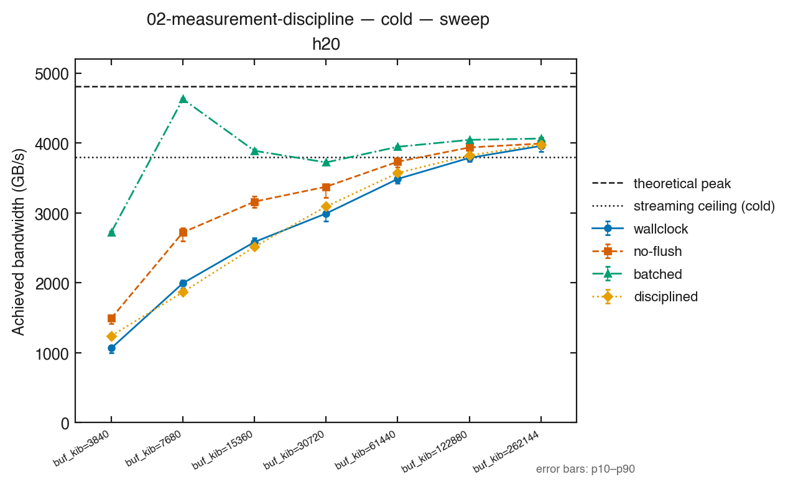
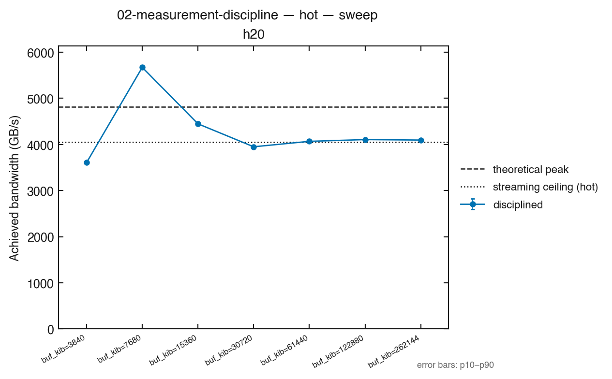

# 02-measurement-discipline

一个可信的数字需要多少纪律。kernel 固定不变（00-template 的 float4 triad），只换计时方法，
看同一个 kernel 能被量出多少个「结果」。

## 要验证的问题

大量 CUDA 性能结论不可复现，原因集中在四件事。这篇把每一件都做成一个可以单独量化的变体：

| 错误 | 对应变体 | 它错在哪 |
|---|---|---|
| 没 flush L2 | `no-flush` | 采样之间不清 L2。工作集装得进 L2 时，第二次起读的是 L2 不是 HBM，报出来的是 L2 带宽 |
| 混了冷热口径 | `batched` | 一个计时区间里连跑 20 次再除以 20，却当成「单次启动延迟」报。启动开销被摊薄，冷缓存只在第一次出现。本仓库 `bench-probe` 的第一版就这么测，报出的「天花板」被 00-template 超过 6% |
| 没预热、host 计时 | `wallclock` | host 时钟包住「启动 + 同步」，不预热。host 侧开销与 OS 抖动全算进去，形成长尾 |
| 报了均值 | 原始样本（`--samples-out`）| 长尾会被均值折进头条数字，分位数不会 |

正确的测法是 `disciplined`，直接调用 `bench::measure_cold` / `measure_hot`，全仓库其余篇目都走它。

**扫描维度是缓冲区大小**，按本机 L2 容量推导（L2 的 1/16 到 2 倍），最后一档是全仓库统一的
工作集 `bench::kStreamBufferBytes`（256 MiB）。shape 列里的 `ws_over_l2` 是三块缓冲区之和除以 L2：

- `ws_over_l2 < 1`：工作集装得进 L2，预期 `no-flush` / `batched` 与 `disciplined` 差得最多
- `ws_over_l2 ≫ 1`：L2 只能装下一小部分，flush 与否的差距应当收敛

**预期在哪台机器不同**：三台卡 L2 不同（a100 40 MiB、h20 60 MiB），同一个绝对尺寸在一台上
装得进、另一台装不进。所以横轴用 `ws_over_l2` 对齐，不用 KiB 对齐。

以上是待验证的假设，不是结论。尤其是「不 flush 能测出高于 HBM 标称的带宽」：小尺寸下单次
启动的固定开销也在变大，两者谁占上风要看数据。测不出来就照实写。

### cold 和 hot 是什么，为什么两个都要

这两个词在本系列所有篇目里含义固定：

- **cold（冷启动）**：每次计时前先把 L2 清空，然后只启动**一次** kernel，计这一次的耗时。
  它回答「一个 kernel 在一次前向里只跑一遍时，实际要花多久」——比如模型每层各执行一次的算子。
  这个数字里包括启动开销和冷缓存。
- **hot（热重放）**：把连续 20 次启动录成一个 CUDA Graph，整体重放，耗时除以 20。
  它回答「同一个 kernel 在循环里反复跑，稳定下来以后每次多快」——比如 decode 循环。
  启动开销被摊薄，缓存已经是热的。

两个数都对，只是回答的问题不同，所以永远分开报，也只和同口径的数比（cold 比 cold，hot 比 hot）。
`batched` 这个错误变体，就是把 hot 的做法冒充成 cold 报出来。

## 目录代码

| 文件 | 作用 |
|---|---|
| `discipline.cu` | 一个 kernel（`triad_vectorized`）+ 四种计时协议。每个尺寸先校验结果再计时；可选 `--samples-out` 输出逐样本原始耗时 |
| `CMakeLists.txt` | 产出目标 `kernel-02-measurement-discipline` |

这篇的 baseline / optimized 与其他篇目的意思不同：kernel 没有两份，**错误的测法是 baseline，
`bench/` 的测法是 optimized**。三个错误协议是故意写错的，只用于演示，不要拿去测别的 kernel。

运行参数：`--sizes-kib a,b,c`（覆盖默认尺寸表）、`--samples`（默认 50）、`--warmup`（默认 5）、
`--batch`（默认 20）、`--samples-out <path>`。

## 所用技术

- `bench::L2Flusher`：按 `l2CacheSize × 2` 分配缓冲区，采样之间写穿它，逼出 L2 里的旧数据
- `cudaEvent` 事件对计时（`no-flush` / `batched` / `disciplined`）与 host `std::chrono`（`wallclock`）对照
- CUDA Graph 重放（`measure_hot`）：把 launch 开销从被测对象里摘出去
- 分位数统计（`bench::summarize`）；本篇给 `measure_cold` / `measure_hot` 加了可选的原始样本输出，统计口径不变
- 尺寸从 `cudaDeviceProp::l2CacheSize` 推导，不写常数

## 本篇在代码之外的部分

提纲第 4、5 节不是这个二进制能单独回答的，需要按下面的方式采集：

- **锁频 vs 不锁频**（第 4 节）：本轮已按 A–B–B–A 采集——锁频（1800 MHz）与未锁频（1980 MHz）
  各两次，见下文实验表
- **ncu 计数器**（第 5 节）：本篇的结论是「测法本身改变数字」，由同一 CSV 内不同协议的直接对比
  就能支撑（未 flush 的协议在小尺寸超过 HBM 标称即为证据），**本轮未采 ncu 计数器，也不作
  计数器层面的因果断言**。h20 上 root 可采（`docs/environment-matrix.md`），若后续要解释
  「L2 命中率」等原因再补

## 实验数据

**H20-3e 单机，2026-09-26，锁频 1800 MHz（未锁频对照实测 1980 MHz），驱动 615.71.09，
MIG Disabled，ECC on，静默门禁通过（PRE/POST `util=0`），commit `0025113`，`git_dirty=no`。**

| CSV | 内容 |
|---|---|
| `results/02-measurement-discipline/2026-09-26-h20.csv` | 锁频（A1），主表 + `-samples.csv` |
| `results/02-measurement-discipline/2026-09-26-h20-locked2.csv` | 锁频（A2），A–B–B–A 的第二轮 A |
| `results/02-measurement-discipline/2026-09-26-h20-unlocked.csv` | 未锁频（B1）|
| `results/02-measurement-discipline/2026-09-26-h20-unlocked-unlocked2.csv` | 未锁频（B2）|

### 各协议 median 带宽（GB/s，锁频 A1；每档 50 样本）

shape 横轴按 `ws_over_l2`（三块缓冲区之和 ÷ L2，L2 = 60 MiB）排列；`batched` 只有 cold，
`disciplined` 有 cold 与 hot。

| buf | ws/L2 | wallclock | no-flush | batched | disciplined cold | disciplined hot |
|---|---|---|---|---|---|---|
| 3840 KiB | 0.188 | 1065 | 1493 | 2724 | 1241 | 3606 |
| 7680 KiB | 0.375 | 1995 | 2721 | 4628 | 1867 | 5673 |
| 15360 KiB | 0.750 | 2584 | 3161 | 3888 | 2516 | 4448 |
| 30720 KiB | 1.500 | 2992 | 3374 | 3722 | 3091 | 3950 |
| 61440 KiB | 3.000 | 3485 | 3732 | 3945 | 3571 | 4068 |
| 122880 KiB | 6.000 | 3787 | 3936 | 4045 | 3822 | 4107 |
| 262144 KiB | 12.800 | 3958 | 3992 | 4063 | 3979 | 4096 |

### 结论与失效边界

- **工作集装得进 L2 时，测法决定结论**：`batched` 相对 `disciplined cold` 在 7680 KiB 档偏高
  2.5×、在 3840 KiB 档偏高 2.2×；`no-flush` 偏高 1.2–1.5×。两者都把 L2 带宽冒充成 HBM 带宽。
- **收敛点**：`ws_over_l2 ≥ 6` 后四种协议（含 hot）落在 3787–4107 GB/s 内，彼此差 <9%；
  256 MiB 档只差约 3.5%。工作集远大于 L2 时，flush 与否不再重要。
- **hot 在小尺寸超过 HBM 标称**：7680 KiB 档 `disciplined hot` 报 5673 GB/s > 4814 GB/s。
  这是按逻辑字节数计算的有效带宽，与热缓存复用一致，不能称为实测 HBM 带宽。
  报「HBM 带宽」应使用 cold，或确认工作集远大于 L2 并核对实际 DRAM 流量。
- **`wallclock` 有最宽的分布**：它包含 host 启动与同步，长尾明显；在最小档它甚至低于
  `disciplined cold`（启动开销占比大），在大尺寸才逼近。任何协议都不该只看单点。

### 锁频 / 未锁频 A–B–B–A（同一张卡、逐样本）

顺序 A1（锁）→B1（不锁）→B2（不锁）→A2（锁）；`wallclock` cold，`ws_over_l2 = 0.188`：

| run | 锁频 | SM 时钟 | mean (ms) | median (ms) | p90 (ms) |
|---|---|---|---|---|---|
| A1 | yes | 1800 | 0.011504 | 0.011073 | 0.011770 |
| B1 | no | 1980 | 0.010979 | 0.010666 | 0.011251 |
| B2 | no | 1980 | 0.011053 | 0.010718 | 0.011398 |
| A2 | yes | 1800 | 0.011325 | 0.010931 | 0.011729 |

- **均值一律高于中位数**（如 A1 高 +3.9%）：host 侧长尾被均值折进头条数字，这就是要报分位数的
  原因。不预设方向，但本轮四个 run 都是 mean > median。
- **本负载的锁频差异很小**：未锁频（1980 MHz）比锁频（1800 MHz）快约 1–4%，且只在小尺寸可见；
  256 MiB 档 <0.5%。这不足以推断所有带宽受限 kernel 都不受 SM 时钟影响。所有锁频轮
  `clocks_locked=yes`、未锁频轮 `no`，`sm_clock_mhz` 分别记 1800 / 1980。
- 全部 7 档 × 4 run 的逐样本数据在 `-samples.csv`（每档每协议 50 样本）；此处只列一档代表。
- **口径限制**：静默门禁只在 PRE/POST 采样，RUN 期间一个起止都在窗口内的短命共租户观测不到
  （见 `docs/measurement-methodology.md` 的 caveat）。

## 截图




`cold-sweep` 是主图：小工作集下 `batched` 明显在 `no-flush` 与 `disciplined` 之上，随
`ws_over_l2` 增大四条线收敛。`hot-sweep` 只有 `disciplined`（其余协议无 hot 口径）。

## 复现

```bash
./tools/collect_h20.sh build
./tools/collect_h20.sh 02 <GPU>
./tools/collect_h20.sh 02-unlocked <GPU>
H20_RUN_TAG=unlocked2 ./tools/collect_h20.sh 02-unlocked <GPU>
H20_RUN_TAG=locked2   ./tools/collect_h20.sh 02 <GPU>
python3 tools/plot.py results/02-measurement-discipline/2026-09-26-h20.csv \
    -o figures/02-measurement-discipline/ --view sweep --x-keys buf_kib
```

`--clocks-locked` 只有真的执行过 `nvidia-smi -lgc` 才能传（`collect_h20.sh` 自动处理）。
samples 文件没有环境列，靠文件名与同日同机器的主 CSV 对应；主 CSV 作废时它一并作废。
