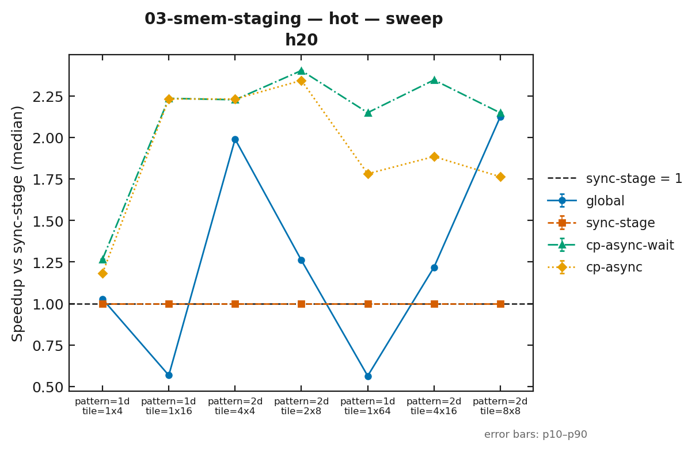

# 03-smem-staging

搬运范式的分水岭：`cp.async` 与它的天花板。把 tile 从 global 喂进计算，四种写法，
看瓶颈到底在「搬多少」还是「谁在搬、搬的时候谁在等」。

## 要验证的问题

内存层级的瓶颈不在容量，而在搬运期间线程能不能干别的。具体拆成三个可量化的问题：

1. **SMEM 值不值得搬**：把 tile 抄进 SMEM（`sync-stage`）比直接在 global 上反复读（`global`）快吗？
   tile 多大时开始划算？
2. **换指令还是换用法**：`cp.async` 的收益有多少来自指令本身（`cp-async-wait`），有多少来自
   「搬运与计算重叠」（`cp-async`）？
3. **失效点在哪**：tile 形状、访问模式（1d 连续 / 2d 分行）变化时，`cp.async` 在哪里不再赢，
   甚至变慢？

**预期在哪台机器不同**：`cp.async` 从 sm_80 起可用，本篇是 A100 真正参与论证的一篇——三台机器
跑的是同一条指令。A100 的 SMEM 上限更小（见下），64 元素的 tile 在 A100 上不存在；h20 算力受限、
h200 算力富余，重叠计算的收益取决于「计算在不在等搬运」，两台的答案可能相反。

以上都是待验证的假设。本轮 H20 数据（见下）显示：**重叠版本 `cp-async` 在 7 个形状里 5 个比
`cp-async-wait` 更慢**，而直接读 global 的 `global` 在 2d 形状上反而快过 `sync-stage`——都写成
负结果。`cp.async` 是 Ampere 时代的指令，不是 CUDA 13 新特性。

## 四个变体

| 变体 | 角色 | 做法 | SMEM |
|---|---|---|---|
| `global` | 对照 | 不搬，依赖链直接在 global 上跑 passes 趟，L2 兜底 | 0 |
| `sync-stage` | **baseline** | `ld.global` + `st.shared` 逐元素抄进 SMEM，再算 | 1 槽 |
| `cp-async-wait` | 拆分对照 | 发 `cp.async` 搬 tile，立刻 `wait_all`，再算 | 1 槽 |
| `cp-async` | **optimized** | 发下一个 tile 的 `cp.async`，趁它在飞算当前 tile，算完再 `wait_all` | 2 槽 |

工作负载：一块 `bench::kStreamBufferBytes`（256 MiB）的 float 数组，切成 Rows × Cols 的 tile，
每个 tile 跑 `passes` 趟依赖链 `s = 0.5*s + v[m]`，结果写回 global。依赖链让每一趟都得重读数据，
编译器合并不了。

## tile 形状与 SMEM 用量

SMEM 数组大小由 tile 形状决定，必须编译期确定，所以形状是固定的实例化表，运行时用 `--shapes` 选子集。

| tile | 模式 | 元素 | `sync-stage` / `cp-async-wait` SMEM | `cp-async` SMEM | sm_80 | sm_90a |
|---|---|---|---|---|---|---|
| 1×4 | 1d | 4 | 4 KiB | 8 KiB | ✅ | ✅ |
| 1×16 | 1d | 16 | 16 KiB | 32 KiB | ✅ | ✅ |
| 4×4 | 2d | 16 | 16 KiB | 32 KiB | ✅ | ✅ |
| 2×8 | 2d | 16 | 16 KiB | 32 KiB | ✅ | ✅ |
| 1×64 | 1d | 64 | 64 KiB | 128 KiB | ❌ | ✅ |
| 4×16 | 2d | 64 | 64 KiB | 128 KiB | ❌ | ✅ |
| 8×8 | 2d | 64 | 64 KiB | 128 KiB | ❌ | ✅ |

SMEM = 256 线程 × 元素数 × 4 B（`cp-async` 再乘 2 个槽）。

**A100 上 64 元素 tile 编译不过**，这是实测到的边界，不是配置问题：`ptxas` 对 sm_80 目标限制每个
入口函数的 SMEM 为 `0xc000`（48 KiB），64 KiB 的 `sync-stage` 就报 `uses too much shared data`；
sm_90a 目标能放下 128 KiB。`CMakeLists.txt` 在目标架构含 sm_8x 时不编这三个形状。这就是提纲
第 1 节「每层的容量与代价」里 SMEM 那一格的数据。

2d 模式的行宽固定为 4092：是 4 的倍数（`cp.async` 要求 16 字节对齐），不是 8 的倍数，所以列数
≥ 8 的 tile 在每行末尾都会被裁小。被裁小的边缘 tile 在所有 staging 变体里一律走同步路径。

## `cp.async` 的三个局限在代码里的位置

提纲第 6 节列出的局限，也是第 04 篇 TMA 的动机清单，都能在 `staging.cu` 里找到对应代码：

| 局限 | 代码位置 |
|---|---|
| 地址计算仍在 SM | `stage_cp_async`：每行行首地址 `(y0 + r) * width + x0` 由 SM 计算，每 16 字节一条指令 |
| 多维 tile 仍要手算 | 2d tile 拆成 Rows 组独立的行搬运，行数越多指令组越多 |
| 边界仍要手判 | `can_cp_async`：非完整 tile 或列数不是 4 的倍数时退回 `stage_sync` |

## 目录代码

| 文件 | 作用 |
|---|---|
| `cp_async.cuh` | **本篇零件：SMEM staging 模板**。`cp_async_16`（一条 `cp.async.cg.shared.global`）、`cp_async_row`、`cp_async_wait_all` |
| `staging.cu` | 四个变体的 kernel、形状分发、host 黄金结果与逐位校验、cold/hot 计时 |
| `CMakeLists.txt` | 产出目标 `kernel-03-smem-staging`；按目标架构决定是否编 64 元素 tile |

**为什么不用 `cuda::memcpy_async`**：在 sm_90 上，16 字节对齐的拷贝配 SMEM 里的 barrier，
`memcpy_async` 会自动改走 `cp.async.bulk`，那是第 04 篇（TMA）的内容；配非 SMEM barrier 时，
它又会在函数内部立刻 `cp.async.wait_all`，重叠就没了。本篇要在三台机器上比同一条指令，还要
自己控制等待的位置，所以直接写指令。写法与 CUDA 13.3.1 头文件里 libcudacxx 的
`__cp_async_shared_global<16>` 与 `memcpy_completion` 一致。

运行参数：`--shapes 1x4,4x4`（形状子集）、`--passes`（默认 4）、`--width`（2d 行宽，默认 4092，
必须是 4 的倍数）、`--samples`（默认 30）、`--warmup`（默认 5）、`--batch`（默认 10）。

## 所用技术

- `__shared__ __align__(128)` SMEM 数组，按 `threadIdx.x` 分行
- `cp.async.cg.shared.global`（sm_80+）：16 字节一条的 global → SMEM 异步搬运，跳过 L1
- `cp.async.wait_all`：只阻塞本线程，等本线程发出的全部 `cp.async` 写完
- grid 按 `multiProcessorCount * 32` 推导，tile 按 grid-stride 分配给线程
- 共用计时 `bench::measure_cold` / `measure_hot`，工作集 `bench::kStreamBufferBytes`
- 每个形状、每个变体先与 host 黄金结果逐位比对再计时（依赖链里 `0.5*s` 精确可表示，host 与
  device 同序计算应逐位一致）

## 实验数据

**H20-3e 单机，2026-09-26，锁频 1800 MHz，驱动 615.71.09，MIG Disabled，ECC on，静默门禁通过，
commit `0025113`，`git_dirty=no`。** 主表：`results/03-smem-staging/2026-09-26-h20.csv`
（7 形状 × 4 变体 × cold/hot = 56 行；每个线程先逐位校验再计时）。

### 相对 `sync-stage` 的 median 加速比

| pattern | tile | elems | 口径 | global | sync-stage | cp-async-wait | cp-async |
|---|---|---|---|---|---|---|---|
| 1d | 1×4 | 4 | cold | 1.03 | 1.00 | **1.26** | 1.18 |
| 1d | 1×16 | 16 | cold | **0.57** | 1.00 | **2.21** | 2.21 |
| 2d | 4×4 | 16 | cold | 1.97 | 1.00 | 2.20 | 2.21 |
| 2d | 2×8 | 16 | cold | 1.25 | 1.00 | **2.36** | 2.31 |
| 1d | 1×64 | 64 | cold | **0.57** | 1.00 | **2.13** | 1.77 |
| 2d | 4×16 | 64 | cold | 1.22 | 1.00 | **2.33** | 1.88 |
| 2d | 8×8 | 64 | cold | 2.12 | 1.00 | 2.14 | 1.76 |

hot 口径与 cold 几乎相同（同一形状的比值差 <2%），完整 56 行见 CSV；`hot` 表不另列。

### 结论与失效边界

- **SMEM staging 不是无条件更快**：`global` 在 1d 大 tile（1×16、1×64）上是 `sync-stage` 的
  **0.57×**（慢近一倍），在 1×4 上打平；但在所有 2d 形状上 `global` 反而比 `sync-stage` 快
  1.2–2.1×，8×8 上甚至快过 `cp-async`。**收益方向由访问模式和 tile 形状决定，不由「用不用
  SMEM」决定。**
- **本组实现里立刻等待已带来大部分收益，双缓冲没有继续获益**：`cp-async-wait`（发完立刻等）在 7 个形状里
  6 个是全场最快（仅 4×4 上 `cp-async` 略高）；双缓冲的 `cp-async` 只在 1×16 与它打平，其余
  5 个形状明显更慢（1×64：1.77 vs 2.13；8×8：1.76 vs 2.14）。**「搬运与计算重叠」在这个负载
  上没有兑现收益。** 这组对照同时改变了拷贝路径和资源用量，不能把差值只归因于一条指令。
- **推测（假设，未由 ncu 证实）**：`cp-async` 用双倍 SMEM、寄存器 40 vs 36，驻留块数减半，
  而每 tile 的计算量太小、重叠省下的等待填不回占用率损失。要证实需要 occupancy 与 stall
  计数器，本轮未采。
- **失效边界**：本实验的四个 2d 形状上，`global` 均优于 `sync-stage`；1×4 小 tile 的收益也有限。
  具体由地址计算、缓存访问还是同步开销主导，需进一步拆分实验。

### ncu 定向计数器（补充证据，2 个代表形状）

命令（H20，root，ncu 2026.2.1；同一二进制，只换 `--kernel-name` 与 `--shapes`）：

```bash
ncu --kernel-name 'regex:<kernel>$' --launch-count 1 \
    --metrics gpu__time_duration.sum,dram__bytes_read.sum,dram__bytes_write.sum,\
launch__registers_per_thread,sm__throughput.avg.pct_of_peak_sustained_elapsed,\
l1tex__t_sectors_pipe_lsu_mem_global_op_ld.sum,l1tex__t_sectors_pipe_lsu_mem_global_op_st.sum \
    --csv ./build/kernels/03-smem-staging/kernel-03-smem-staging \
    --shapes 1x16 --warmup 1 --samples 2 --batch 2
```

计数器摘录：`results/03-smem-staging/ncu/2026-09-26-h20-counters.csv`（每个变体取首个 launch，
即正确性校验那次；未保存 ncu 的完整原始 report，正文若引用具体计数器，应先补存原始输出与
每个变体的完整命令。`gpu_time_ns` 受 profiling 影响，**不作为性能数字**）。

| shape | variant | dram_read | l1_load_sectors | regs | sm_throughput | time_ns |
|---|---|---|---|---|---|---|
| 1x16 | global | 269.2 MB | 268.4 M | 32 | 11.3% | 974656 |
| 1x16 | sync-stage | 268.5 MB | 67.1 M | 38 | 17.5% | 552192 |
| 1x16 | cp-async-wait | 268.5 MB | 16.8 M | 36 | 30.2% | 247520 |
| 1x16 | cp-async | 268.5 MB | 16.8 M | 40 | 32.9% | 248064 |
| 1x64 | global | 300.1 MB | 268.4 M | 32 | 3.5% | 1910720 |
| 1x64 | sync-stage | 268.5 MB | 67.1 M | 38 | 4.6% | 1080224 |
| 1x64 | cp-async-wait | 268.5 MB | 16.8 M | 36 | 7.5% | 501440 |
| 1x64 | cp-async | 268.5 MB | 16.8 M | 40 | 6.5% | 604512 |

- **有证据的**：四个变体的 DRAM 读字节基本相同（~268 MB，`global` 在 1x64 略高），说明慢/快
  **不是** HBM 流量差异；差异在 L1 load sector 数——`global` 268 M、`sync-stage` 67 M、
  `cp.async` 系 16.8 M，与「`global` 反复经 L1/L2 重读、staging 只搬一次」一致。寄存器数
  也**不是** `global` 慢的原因（它最少，32）。
- **仍是假设**：sector 数为何恰好是这些倍数、`cp-async` 相对 `cp-async-wait` 的占用损失多大，
  计数器不足以定论。仅凭这 2 个形状、且是正确性 launch，不能外推到全部 7 个形状。

## 截图




两图横轴为 7 个形状，纵轴为相对 `sync-stage`（虚线 =1）的 median 加速比，误差棒 p10–p90。
`global` 的折线在 1d 大 tile 上掉到 0.6 以下、在 2d 上抬到 1–2 之间，正是失效边界的可视化。

## 复现

```bash
./tools/collect_h20.sh build
./tools/collect_h20.sh 03 <GPU>
python3 tools/plot.py results/03-smem-staging/2026-09-26-h20.csv -o figures/03-smem-staging/ \
    --view sweep --metric speedup --baseline sync-stage --x-keys pattern,tile
```

A100 需要单独用 `-DCMAKE_CUDA_ARCHITECTURES=80` 构建，且先按 `docs/environment-matrix.md` 导出
forward-compat 的 `LD_LIBRARY_PATH`（sm_80 下不编 64 元素 tile）。
